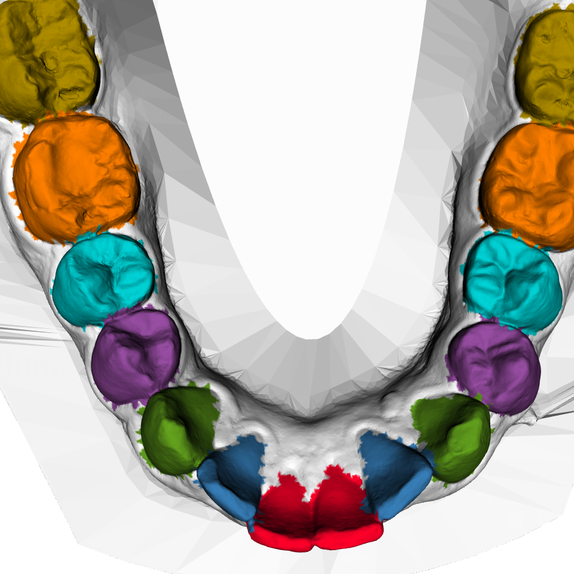

# MeshVisualizer



This repository contains script to build a docker container that can be used to perform offscreen render on a remote server.

**Usecase**: projects working on mesh need a tool to visualize meshes for quick viewing without opening a dedictaed mesh viewer such as meshlab or paraview. This is difficult in a remote server like ours where a GUI may not be available.
**Proposal**: Run vedo library on a docker container with xvfb and libgl1-mesa.  

**Docker Build and Test Instructions**

The `test.sh` creates a docker container called `vedo-test-local`. It also runs a test python script that renders a sphere and writes the screenshot to `output` dir of the working directory.
```
$ ./test.sh
$ docker run --rm -v local-dir-absolute-path:/app/data vedo-test-local:latest python save_screenshot.py path-to-ply-file.ply path-to-output-file.png
$example: docker run --rm -v /mnt/driveD/sources-git/3d-teeth-seg-miccai/pretrained_models/pointnet_220720_074533/evaluation/ply:/app/data vedo-test-local:latest python save_screenshot.py /app/data/decimated_01HXMTNF_lower.ply /app/data/decimated_01HXMTNF_lower.png
```

**Run Instructions**
Assuming, your mesh files are stored in a directory, the `run.sh` script creates offscreen-render of all mesh files in the directory and stores them in a `png` format. 
```shell
$ run.sh -i input-directory
```
runs the rendering command to each ply files in the input directory. The renderings are stored in the subdirectory `rendering`.

for more details: https://vedo.embl.es/autodocs/content/vedo/index.html

**Known Issues**

Please change the Docker file as follows to to avoid permission issues when loading mounted dir as volumes:
1. Find your groupid and userid in the host system.
```
$id your-user-name
for example: $id mahesh
 uid=1002(mahesh) gid=1002(mahesh) groups=1002(mahesh),1009(needpass),998(docker)
```
2. Change the userid and groupid in the `Dockerfile`. Currently, the userid and groupid is set to 1002.
